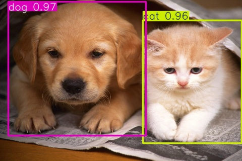

<h2 align="center">
    <a href="https://dainam.edu.vn/vi/khoa-cong-nghe-thong-tin">
    🎓 Faculty of Information Technology (DaiNam University)
    </a>
</h2>

<h2 align="center">
   🚀 Object Detection System using YOLO
</h2>

<div align="center">
    <p align="center">
        
        
    </p>

[]
[]
[]

</div>

---

## 1. 📌 Giới thiệu

**Object Detection System** là một hệ thống nhận diện vật thể sử dụng mô hình **YOLOv8** kết hợp với **Flask Web**.

Hệ thống cho phép:
- 📷 Upload ảnh để nhận diện
- 🎥 Detect video realtime
- 📊 Đếm số lượng object
- 📁 Xuất dữ liệu ra file CSV

Đây là đồ án thuộc môn **Xử lý ảnh (Image Processing)**.

---

## 2. 🎯 Mục tiêu đề tài

- Ứng dụng Deep Learning vào nhận diện vật thể
- Xây dựng hệ thống web tương tác đơn giản
- Xử lý ảnh và video realtime
- Lưu trữ dữ liệu phục vụ phân tích

---

## 3. 📂 Dataset

Dự án sử dụng dataset:

👉 **PASCAL VOC 2007**

Bao gồm 20 lớp vật thể:
- person, car, dog, cat, chair, bottle, bus, train...
  
👉 Dataset đã được:
- Convert sang định dạng YOLO
- Chia train / validation

---

## 4. ⚙️ Hướng triển khai

### 🔹 Bước 1: Chuẩn bị dữ liệu
- Tải dataset VOC
- Convert XML → YOLO format

### 🔹 Bước 2: Train model
- Sử dụng YOLOv8
- Train với:
  - epochs: 50 → 100
  - imgsz: 640

### 🔹 Bước 3: Xây dựng web
- Flask backend
- HTML + Bootstrap frontend

### 🔹 Bước 4: Xử lý ảnh/video
- OpenCV đọc dữ liệu
- YOLO detect
- Vẽ bounding box

### 🔹 Bước 5: Lưu dữ liệu
- Xuất file CSV:
  - class
  - confidence
  - bounding box

---

## 5. 🔥 Tính năng chính

✔ Nhận diện vật thể trong ảnh  
✔ Nhận diện video realtime  
✔ Hiển thị bounding box  
✔ Lọc theo độ chính xác (confidence)  
✔ Đếm số lượng object  
✔ Xuất file CSV  

---

## 6. 🖥️ Giao diện

<div align="center">
    
    <p><i>Kết quả nhận diện vật thể</i></p>
</div>

---

## 7. 🧠 Công nghệ sử dụng

[](https://www.python.org/)
[](https://github.com/ultralytics/ultralytics)
[](https://flask.palletsprojects.com/)
[](https://opencv.org/)

---

## 8. ⚡ Cài đặt

### 🔹 Clone project
```bash
git clone https://github.com/username/your-repo.git
